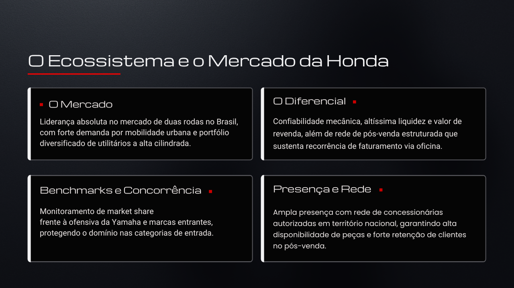
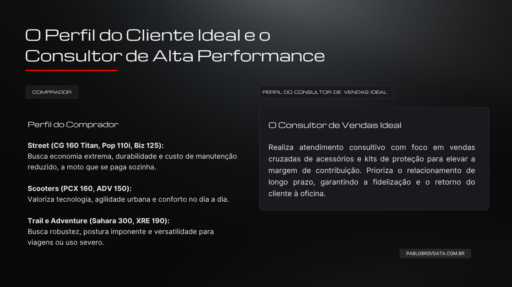
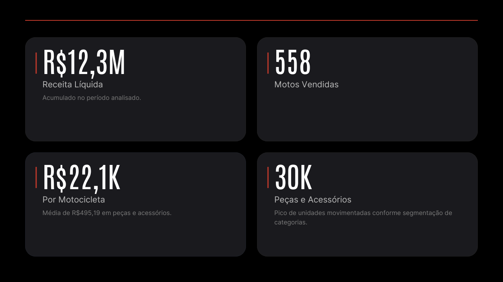
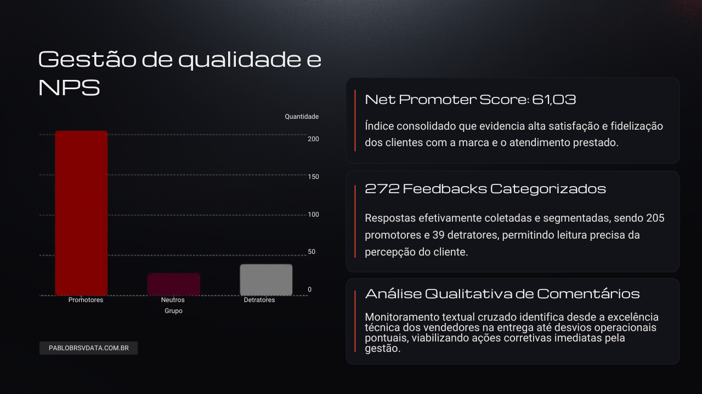
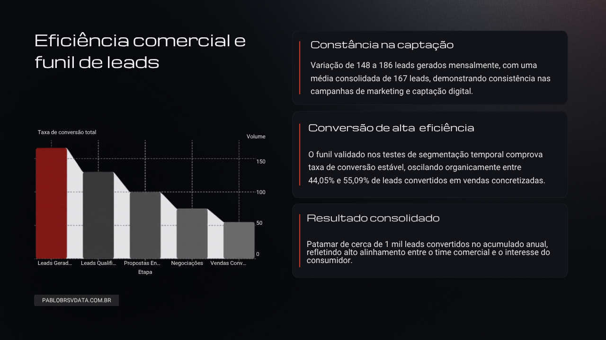
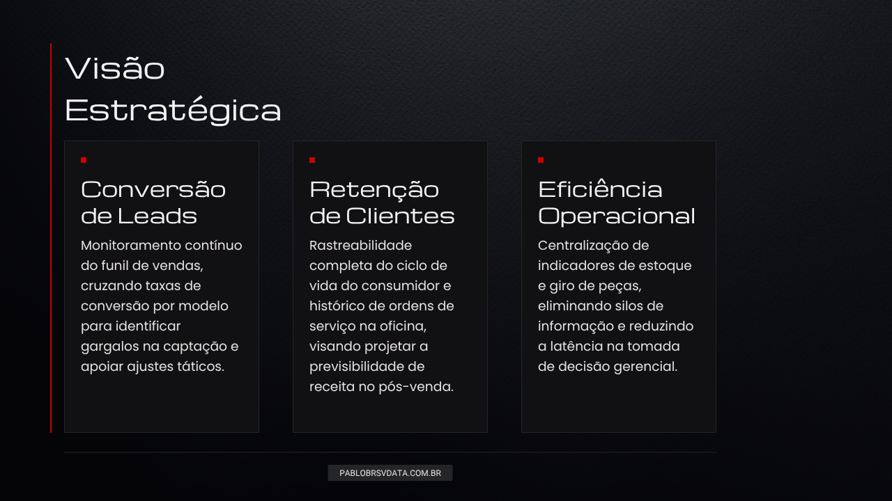
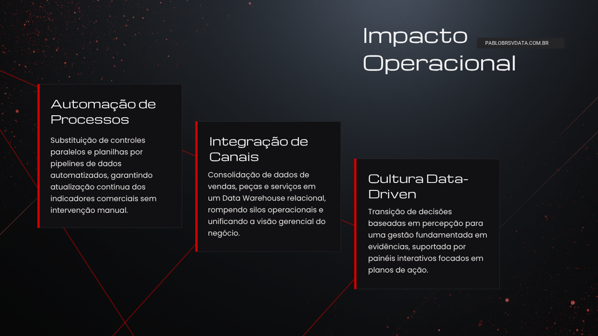
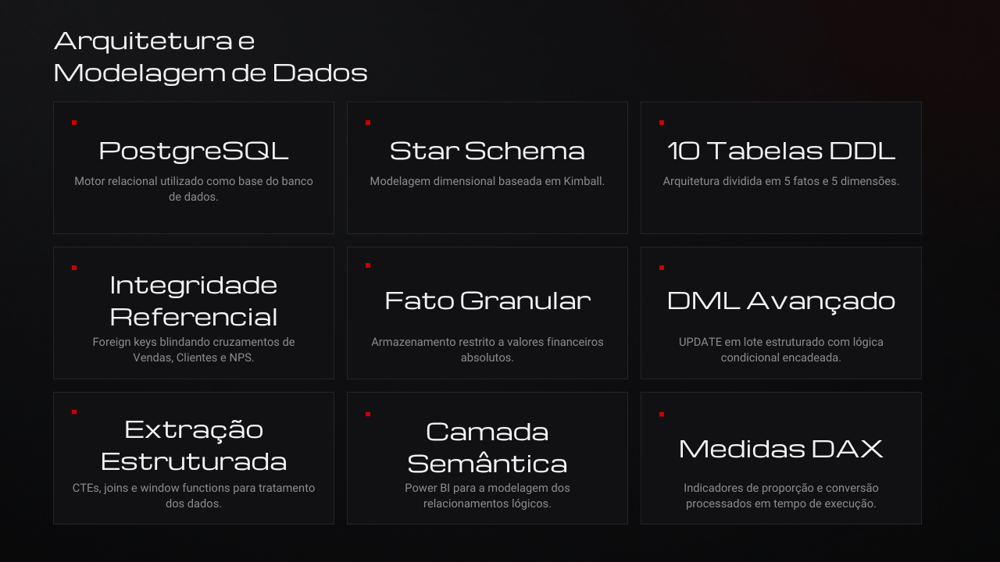
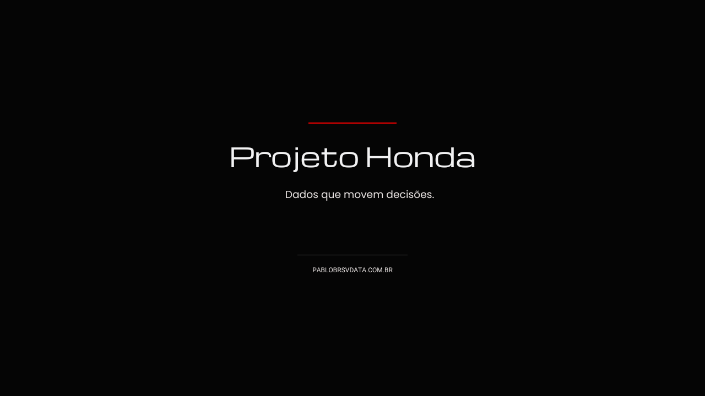

# Inteligência de Dados e Análise Comercial

Este repositório contém a infraestrutura de dados, os scripts de banco de dados e a documentação técnica do Projeto Honda. 

### 🎯 Links Rápidos

* **Case Executivo (PDF):** 👉 [Baixar Dossiê Executivo do Case em PDF](./assets/CASE-PROJETO-HONDA-INTELIGENCIA-DE-DADOS-E-ANALISE-COMERCIAL.pdf)

* **Dashboard Interativo:** [🔗 Acesse o painel online no Power BI](https://app.powerbi.com/view?r=eyJrIjoiYjFlZWMzYjYtODVmMC00MTBhLTg1ZGYtYmI5Yjk2ZjgxZmU2IiwidCI6IjY1OWNlMmI4LTA3MTQtNDE5OC04YzM4LWRjOWI2MGFhYmI1NyJ9&pageName=ad8f0c52c9e1fed9b930)

### 🛠️ Stack Tecnológico

* **Banco de Dados:** PostgreSQL
* **Modelagem Dimensional:** Star Schema (Kimball)
* **Front-end / BI:** Power BI
* **Linguagens:** SQL (DDL/DML), DAX

### 🏗️ Arquitetura e Modelagem

* **Estrutura Física:** 10 tabelas estruturadas via script (5 tabelas Fato e 5 tabelas Dimensão).
* **Consistência:** Garantia de integridade referencial via restrições de Primary Keys e Foreign Keys.
* **Regras de Negócio:** Tabelas Fato restritas ao armazenamento de valores financeiros e quantitativos absolutos.
* **Otimização:** Uso de CTEs, Joins e lógicas condicionais (CASE WHEN) para tratamento de dados.
* **Camada Semântica:** Cálculos de proporção e indicadores processados exclusivamente em tempo de execução.

### 📂 Mapeamento do Repositório

* `/ddl`: Scripts estruturais para recriação do banco de dados relacional.
* `/dax`: Códigos de todas as medidas utilizadas no painel, segmentadas por contexto de negócio (Leads, NPS, Vendas).
* `/assets`: Arquivos binários, incluindo o documento PDF e o arquivo fonte original (`.pbix`).

  ---

    
    
    
    
    
    
    
    
    
    
    
    
  

